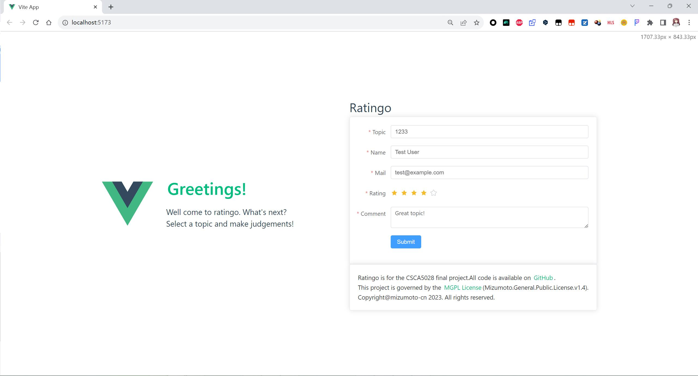
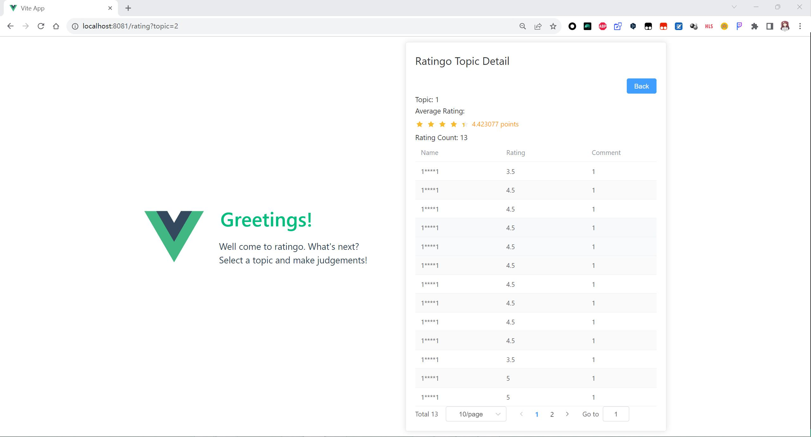
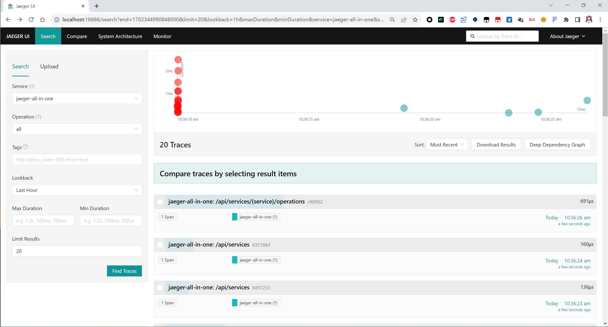

# Ratingo

> Homework for CUBoulder CSCA5028 final
> You can find the assignment report [here](#report)

## Description

This project is a rating system where users can sign in with their email and names to rate and comment on specific topics. The system is divided into three parts: Data Collection, Data Analysis, and Frontend UI. The Data Collection and Data Analysis parts are connected through RESTful API.

## Getting Started

### Dependencies

* Use docker compose file to build the environment

```docker
docker compose up -d
```

### Build and Compile

backend: `go build`

frontend: `cd /web/ratingo && npm run build`

### Quick Run

See [trojan.mizumoto.tech:8081](<http://trojan.mizumoto.tech:8081>)

## Report

### System Requirements

* **Software**
  * Go: The backend services are written in Go, so you’ll need the Go compiler to build and run them.
  +Docker: Docker is used to containerize the services and dependencies such as Jaeger for distributed tracing and MySQL for the database.
  * MySQL: MySQL is used as the database for storing user, topic, rating, and analysis data.
  * Gin: Gin is a web framework used for handling HTTP requests in Go.
  * Ent: Ent is an entity framework for Go that is used as an ORM for handling database operations.
  * Wire: Wire is a code generation tool for dependency injection in Go.
  * Jaeger: Jaeger is used for distributed tracing to monitor and troubleshoot transactions in complex distributed systems.
  * RabbitMQ: RabbitMQ will be used as a message broker for the system.

Most of which can be get through docker compose file or `go get`

### Design Decisions

* **Architecture**
  * The system is divided into separate parts (Data Collection, Data Analysis, and Frontend UI) to allow for scalability and modularity. The Data Collection and Data Analysis parts are connected through RESTful API.

.png)

* **RESTful API**
  * The RESTful API is used to connect the Data Collection and Data Analysis parts of the system.
* **Database**
  * MySQL is used as the database for storing user, topic, rating, and analysis data.
  * The database schema is designed to efficiently store and retrieve data related to users, topics, ratings, and analysis.
* **Distributed Tracing**
  * Jaeger is used for distributed tracing to monitor and troubleshoot transactions in complex distributed systems.
  * Jaeger is used to monitor the Data Collection and Data Analysis parts of the system.
* **Frontend UI**
  * Using vue3 with typescript to build the frontend UI, the frontend UI is designed to be simple and easy to use.

### Data collection

The collection parts reads in the given data from the frontend UI posted by user and stores it separately in the database. The data collection part is written in Go and uses Ent as an ORM for handling database operations. The data collection part is connected to the frontend UI through RESTful API.

After the collection part is done, the data is stored in the database and then the analysis part is triggered.

### Data analysis

The analysis part reads in the data from the database and performs analysis on the data. The analysis part is written in Go and uses Ent as an ORM for handling database operations. The analysis part is connected to the data collection part through RESTful API.

As soon it is triggered, the analysis part reads in the data from the database and performs analysis on the data, so you can see the result in the frontend UI.

### Frontend UI

The frontend UI is written in Vue3 with Typescript. The frontend UI is designed to be simple and easy to use. The frontend UI is connected to the data collection part through RESTful API.



After you post the rating and comment, you will be redirected to the result page, where you can see the result of the analysis.



### Unit Test

Both Ent and Gin have their own unit test mockups, making it easy to test the code.

You can see the test codes at [display_test.go](./pkg/display/display_test.go) and [collector_test.go](./collector/collector_test.go) and [analyzer_test.go](./analyzer/analyzer_test.go).

Ent mock example:

```go
// Create a mock client
 client := enttest.Open(t, "sqlite3", "file:ent?mode=memory&cache=shared&_fk=1")
```

Gin mock example:

```go
// Set up Gin with the Analyze handler
 r := gin.Default()
 r.POST("/analyze", analyzer.Analyze(client))

 // Create a request to send to the handler
 reqBody := analyzer.AnalyzeRequest{Topic: 1}
 reqBodyBytes, _ := json.Marshal(reqBody)
 req, _ := http.NewRequest(http.MethodPost, "/analyze", bytes.NewBuffer(reqBodyBytes))
 req.Header.Set("Content-Type", "application/json")

 // Record the response
 resp := httptest.NewRecorder()

 // Call the handler
 r.ServeHTTP(resp, req)

 // Check the response
 fmt.Printf("%+v\n", resp.Body.String())
 assert.Equal(t, http.StatusInternalServerError, resp.Code)
```

### Integration tests

The integration tests are much like the combination of the unit tests, but with more complex scenarios.

Still they are helped by the mighty Ent and Gin built-in mockups.

### Data persistence

The data is stored in the MySQL database, which is a relational database management system. The database schema is designed to efficiently store and retrieve data related to users, topics, ratings, and analysis.

Ent is the best ORM for Go, it can generate the database schema automatically, and it is easy to use.

### Rest collaboration internal or API endpoints

The RESTful API is used to connect the Data Collection and Data Analysis parts of the system, also with the frontend UI.

They are:

```go
  v1.POST("/collect", collector.Collect(db))
  v1.POST("/analyze", analyzer.Analyze(db))
  v1.POST("/display", display.Display(db))
```

### Product environment

The project is cross-platform, and can be run on any platform that supports Go, nodejs and Docker.

### Production monitoring instrumenting

Jaeger is used for distributed tracing to monitor and troubleshoot transactions in complex distributed systems.

You can see the result at [trojan.mizumoto.tech:16686](<http://trojan.mizumoto.tech:16686/search?end=1702363587564000&limit=20&lookback=1h&maxDuration&minDuration&service=jaeger-all-in-one&start=1702359987564000>)



### CI/CD

The project is developed on GitHub, and the CI/CD will be done by GitHub Actions.

Auto build and deploy to the server when a new commit is pushed to the master branch.
